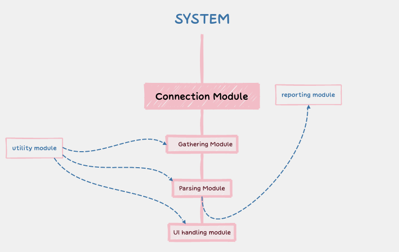

# Working Cycle

---

Built-in Python, this centralized web app is structured into six key modules for log analysis and vulnerability detection in CRPF's IT infrastructure.

## Table of Contents

- [Working Cycle](https://www.notion.so/Working-Cycle-36152a04617d47929859874e37c633de?pvs=21)
    - [Connection Module](https://www.notion.so/Working-Cycle-36152a04617d47929859874e37c633de?pvs=21)
    - [Gathering Module](https://www.notion.so/Working-Cycle-36152a04617d47929859874e37c633de?pvs=21)
    - [Parsing Module](https://www.notion.so/Working-Cycle-36152a04617d47929859874e37c633de?pvs=21)
    - [UI Handling Module](https://www.notion.so/Working-Cycle-36152a04617d47929859874e37c633de?pvs=21)
    - [Reporting Module](https://www.notion.so/Working-Cycle-36152a04617d47929859874e37c633de?pvs=21)
    - [Utility Module](https://www.notion.so/Working-Cycle-36152a04617d47929859874e37c633de?pvs=21)

## Working Cycle

Built-in Python, this centralized web app is structured into six key modules for log analysis and vulnerability detection in CRPF's IT infrastructure.

- The **Connection Module** ensures data retrieval,
- followed by the **Gathering Module** consolidating information.
- The **Parsing Module** extracts insights,
- **UI Handling** Module ensures an intuitive interface.
- The **Reporting Module** generates detailed reports/alerts.
- Utility Module enhances overall functionality and management

Figure showing the relation between the six core modules:

# Connection Module

- Facilitates essential shell access for other modules.
- Either running as an OS service, persistent installation, or secure remote execution (without installation)

# Gathering Module

- Simultaneously collects various logs and events through Parallel Processing, ensuring efficient indexing and caching for rapid retrieval.
- Executes other sub-modules and scripts, performs scans, reads selected file contents, and references vulnerability databases for potential assignments.
- Monitors common user behavior, identifying patterns indicative of potential malicious activities for threat detection.

# Parsing Module

- Assign a unique UUID to each report for efficient referencing in ticket tools.
- Custom Log Parsing Rules to extract valuable data, producing polished logs and reports with timestamps and priority-based color coding.
- Generates encrypted reports and stores them in the database for secure and organized storage.

# UI Handling Module

- Intuitive User Interface: Implements a global search with Fuzzy Finder (fzf), autocomplete suggestion, and advanced optimized query options. Features include filtering, sorting, archiving/watch list, and frequently used search patterns.
- Visual Insights: Integrates powerful visualization tools such as charts and graphs, Timeline View, and other visual representations.
- Enhanced User Interaction: seamless fast interaction through draggable cards, an adjustable clean UI interface, and fast refresh and response times.

# Reporting Module

- Automatically generates a ticket with all relevant information and unique ID upon detecting suspicious activities, forwarding them to the alerting module.
- Sends real-time alerts and notifications to designated Slack channels and connected social platforms.
- Updates the user interface, emphasizing high-priority information,
- allowing exporting detailed logs/reports in multiple formats, like PDF and Word doc, with printing functionality.

# Utility Module

- Facilitates easily modifiable settings, setting customizable logs/report generation preferences, interfaces, and themes.
- Manages collaborative functionalities with multi-user support and authentication. Synchronizes config across admins/user account
- manage snapshots and rollback previews for referencing the state of the application, logs, and reports at a specific point in time.

# Connection Module:

- Facilitates essential shell access for other modules.
- Either running as an OS service, persistent installation
or secure remote execution (without installation)

# Gathering Module:

- Simultaneously collects various logs and events through Parallel Processing, ensuring efficient indexing and caching for rapid retrieval.
- Executes other sub-modules and scripts, performs scans, reads selected file contents, and references vulnerability databases for potential assignments.
- Monitors common user behavior, identifying patterns indicative of potential malicious activities for threat detection.

# Parsing Module

- Assign a unique UUID to each report for efficient referencing in ticket tools.
- Custom Log Parsing Rules to extract valuable data, producing polished logs and reports with timestamps and priority-based color coding.
- Generates encrypted reports and stores them in the database for secure and organized storage.

# UI Handling Module

- Intuitive User Interface: Implements a global search with Fuzzy Finder (fzf), autocomplete suggestion, and advanced optimized query options. Features include filtering, sorting, archiving/watch list, and frequently used search patterns.
- Visual Insights: Integrates powerful visualization tools such as charts and graphs, Timeline View, and other visual representations.
- Enhanced User Interaction: seamless fast interaction through draggable cards, an adjustable clean UI interface, and fast refresh and response times.

# Reporting Module

- Automatically generates a ticket with all relevant information and unique ID upon detecting suspicious activities, forwarding them to the alerting module.
- Sends real-time alerts and notifications to designated Slack channels and connected social platforms.
- Updates the user interface, emphasizing high-priority information,
- allowing exporting detailed logs/reports in multiple formats, like PDF and Word doc, with printing functionality.

# Utility Module

- Facilitates easily modifiable settings, setting customizable logs/report generation preferences, interfaces, and themes.
- Manages collaborative functionalities with multi-user support, and authentication. Synchronizes config across admins/user account
- manage snapshots and rollback previews for referencing the state of the application, logs, and reports at a specific point in time.
